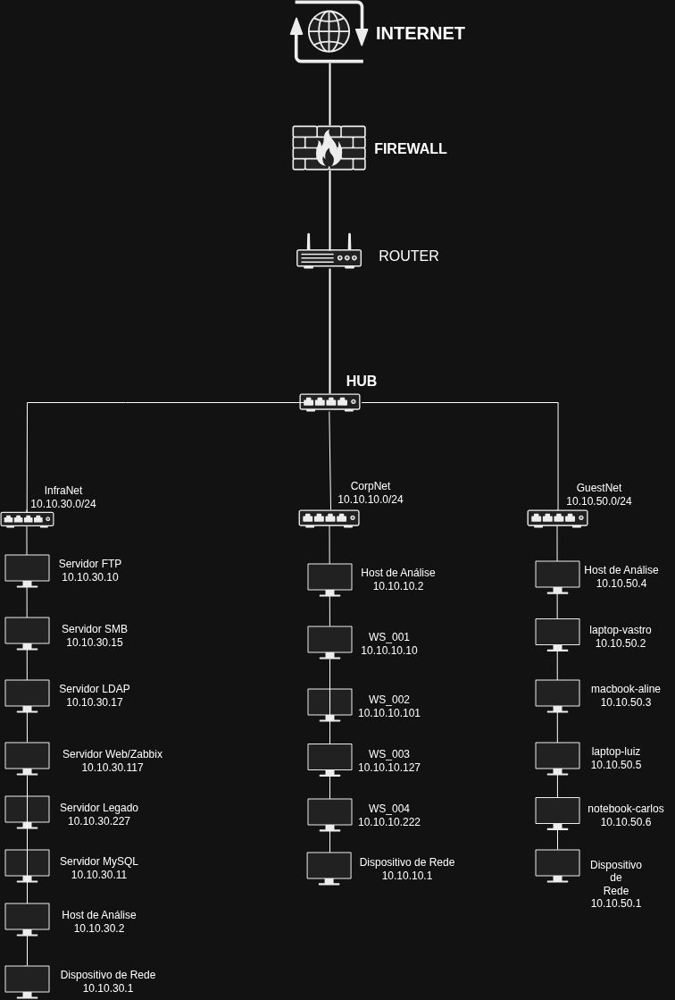

# Relatório de Análise de Rede

**Autor:** Felipe Mascena Seabra 
**Data:** 27/07/2025 
**Versão:** 1.0 

---

## Sumário Executivo

Este relatório detalha a análise de uma rede corporativa simulada, segmentada em três sub-redes principais: Infraestrutura, Corporativa e Visitantes. Foram identificados múltiplos hosts e serviços expostos, incluindo servidores web, FTP, SMB, LDAP e MySQL, além de estações de trabalho e dispositivos de rede. As principais vulnerabilidades identificadas estão relacionadas à exposição de serviços críticos e à necessidade de revisão das regras de segmentação entre as redes. Recomendações incluem a implementação de controles de acesso mais rigorosos e a desativação de serviços desnecessários para mitigar riscos de segurança.

## Objetivo

Analisar a rede simulada para identificar exposição de serviços, verificar a efetividade da segmentação e propor recomendações para mitigar riscos operacionais e de segurança.

## Escopo

O escopo desta análise abrange um ambiente Docker simulado, que inclui múltiplos hosts e redes logicamente segmentadas, conforme descoberto durante a fase de reconhecimento.

## Metodologia

A análise foi conduzida utilizando ferramentas de linha de comando amplamente empregadas em auditorias de segurança e assessments internos:

* **nmap**: Utilizado para varredura de ping (`-sn`) para identificar hosts ativos e para varredura de portas e scripts específicos de serviços (FTP, SMB, LDAP, MySQL).
* **rustscan**: Empregado para varreduras rápidas de portas em ranges de IPs.
* **ping**: Usado para verificar a conectividade básica com hosts específicos.
* **curl**: Para interagir com serviços web e obter banners/conteúdo HTML.
* **ip a**: Para identificar as interfaces de rede e seus endereçamentos IP no host de análise.
* **arp -a**: Para mapear endereços IP a endereços MAC de hosts na rede local e salvar informações.

A metodologia consistiu em coleta ativa de dados de rede, seguida de análise manual e documentação dos achados.

## Diagrama de Rede

## Diagnóstico (Achados)

### Redes Identificadas:

| Nome estimado | Subnet Descoberta | Finalidade suposta        |
| :------------ | :---------------- | :------------------------ |
| InfraNet      | 10.10.30.0/24     | Infraestrutura / Servidores |
| CorpNet       | 10.10.10.0/24     | Rede Corporativa / Dispositivos |
| GuestNet      | 10.10.50.0/24     | Rede de Visitantes / Dispositivos |

### Dispositivos por Rede:

**InfraNet (10.10.30.0/24)**

| IP         | Função                       | Evidência                                                | Risco Identificado                                                     |
| :--------- | :--------------------------- | :------------------------------------------------------- | :--------------------------------------------------------------------- |
| 10.10.30.1 | Dispositivo de Rede (Gateway/Outro) | Responde ping, aparece em nmap -sn.                     | Potencial ponto de acesso ou segregação.                               |
| 10.10.30.10 | Servidor FTP                 | Porta 21/tcp aberta, serviço ftp (Nmap).                 | Possível FTP anônimo, exposição de arquivos sensíveis.                  |
| 10.10.30.15 | Servidor SMB                 | Porta 445/tcp aberta, serviço microsoft-ds (Nmap).       | Compartilhamentos não autenticados, enumeração de usuários.            |
| 10.10.30.17 | Servidor LDAP                | Porta 389/tcp aberta, serviço ldap (Nmap ldap-rootdse script). | Enumeração de diretórios, dados sensíveis.                             |
| 10.10.30.117 | Servidor Web/Zabbix          | Porta 80/tcp aberta, Nginx, PHP/7.3.14, Zabbix SIA (curl). | Interface de monitoramento exposta, vulnerabilidades web.              |
| 10.10.30.227 | Servidor Legado              | Responde ping, aparece em nmap -sn (evidência primária em arp -a). | Serviço/OS desatualizado, falta de patches.                            |
| 10.10.30.2 | Host de Análise              | IP do próprio analista na rede, porta 50790/tcp fechada. | Exposição a ataques de rede se mal configurado.                        |
| 10.10.30.11 | Servidor MySQL               | Porta 3306/tcp e 33060/tcp abertas, serviço mysql (Nmap com script mysql-info). | Acesso a banco de dados, possível injeção SQL, força bruta ou acesso a dados sensíveis, dependendo da configuração e credenciais. |

**CorpNet (10.10.10.0/24)**

| IP          | Função                        | Evidência                          | Risco Identificado                           |
| :---------- | :---------------------------- | :--------------------------------- | :------------------------------------------- |
| 10.10.10.1  | Dispositivo de Rede (Gateway/Outro) | Responde ping, aparece em nmap -sn. | Potencial ponto de acesso ou segregação.     |
| 10.10.10.10 | Estação de Trabalho (WS\_001) | Responde ping, aparece em nmap -sn. | Exposição a ataques de rede, movimentação lateral. |
| 10.10.10.101 | Estação de Trabalho (WS\_002) | Responde ping, aparece em nmap -sn. | Exposição a ataques de rede, movimentação lateral. |
| 10.10.10.127 | Estação de Trabalho (WS\_003) | Responde ping, aparece em nmap -sn. | Exposição a ataques de rede, movimentação lateral. |
| 10.10.10.222 | Estação de Trabalho (WS\_004) | Responde ping, aparece em nmap -sn. | Exposição a ataques de rede, movimentação lateral. |
| 10.10.10.2  | Host de Análise               | IP do próprio analista na rede.    |                                              |

**GuestNet (10.10.50.0/24)**

| IP          | Função                        | Evidência                          | Risco Identificado                           |
| :---------- | :---------------------------- | :--------------------------------- | :------------------------------------------- |
| 10.10.50.1  | Dispositivo de Rede (Gateway/Outro) | Responde ping, aparece em nmap -sn. | Potencial ponto de acesso ou segregação.     |
| 10.10.50.2  | Dispositivo Guest (macbook-aline) | Responde ping, aparece em nmap -sn. | Poucos serviços ativos, mas possível via de acesso se mal configurado. |
| 10.10.50.3  | Dispositivo Guest (laptop-luiz) | Responde ping, aparece em nmap -sn. | Poucos serviços ativos, mas possível via de acesso se mal configurado. |
| 10.10.50.4  | Dispositivo Guest (laptop-vastro) | Responde ping, aparece em nmap -sn. | Poucos serviços ativos, mas possível via de acesso se mal configurado. |
| 10.10.50.5  | Dispositivo Guest (notebook-carlos) | Responde ping, aparece em nmap -sn. | Poucos serviços ativos, mas possível via de acesso se mal configurado. |
| 10.10.50.6  | Host de Análise               | IP do próprio analista na rede.    |                                              |

### Adicionar ao Diagnóstico (Achados) - Achados Específicos e Evidências:

Aqui você vai detalhar os achados mais importantes, usando a estrutura de \[Host/IP] - \[Serviço] - \[Porta]. Para cada um, mencione o risco identificado e a evidência (saída do scan).

**10.10.30.10 - FTP - Porta 21/tcp**

* **Risco identificado**: Potencial para FTP anônimo ou credenciais fracas, permitindo acesso e exfiltração de dados. O script `ftp-anon` do Nmap foi executado, mas a saída específica sobre o resultado da verificação de anonimato não foi apresentada. Se for anônimo, representa um alto risco de vazamento de informações.
* **Evidência**: Saída do `nmap -p 21 --script ftp-anon 10.10.30.10` mostrando `PORT 21/tcp open ftp`. (Salvo em `infra_net_servico_ftp-anon.txt`).

**10.10.30.15 - SMB - Porta 445/tcp**

* **Risco identificado**: SMB exposto pode permitir enumeração de compartilhamentos, usuários e, em caso de vulnerabilidades como EternalBlue ou credenciais fracas, acesso não autorizado ao sistema de arquivos ou execução remota de código.
* **Evidência**: Saída do `nmap -p 445 --script smb-os-discovery,smb-enum-shares 10.10.30.15` mostrando `PORT 445/tcp open microsoft-ds`. (A saída do `smb-enum-shares` não foi fornecida nos prints, mas o comando foi executado e o resultado salvo em `infra_net_servico_smb.txt`).

**10.10.30.17 - LDAP - Porta 389/tcp**

* **Risco identificado**: Acesso ao serviço LDAP pode permitir enumeração de usuários, grupos e outras informações de diretório que podem ser usadas em ataques de força bruta ou spear phishing. A presença de `namingContexts: dc=example,dc=org` e vários mecanismos SASL pode indicar uma configuração padrão ou informações úteis para um atacante.
* **Evidência**: Saída do `nmap -p 389 --script ldap-rootdse 10.10.30.17` mostrando `PORT 389/tcp open ldap` e os detalhes do rootDSE. (Salvo em `infra_net_servico_ldap-rootdse.txt`).

**10.10.30.117 - Web Server (Nginx/PHP/Zabbix) - Porta 80/tcp**

* **Risco identificado**: Servidor web exposto, rodando Nginx e PHP, com uma interface Zabbix. Possíveis vulnerabilidades na versão do PHP (7.3.14), no Nginx ou no próprio Zabbix (desatualização, credenciais padrão). Uma interface de monitoramento como o Zabbix, se comprometida, pode oferecer um ponto de controle crítico na rede.
* **Evidência**: Saída do `curl -I http://10.10.30.117` mostrando `Server: nginx`, `X-Powered-By: PHP/7.3.14` e a saída de `curl http://10.10.30.117` revelando o título "Zabbix SIA" no HTML. (Salvo em `infra_net_servico_webserver.txt` e `infra_net_servico_zabbix.txt`).

**10.10.30.11 - Servidor MySQL - Porta 3306/tcp e 33060/tcp**

* **Risco identificado**: Acesso ao banco de dados MySQL, que pode ser alvo de injeção SQL, força bruta de credenciais e acesso indevido a dados sensíveis. A versão `8.0.42` foi identificada, e o plugin `caching_sha2_password` está em uso, o que é uma melhoria de segurança, mas ainda requer credenciais fortes.
* **Evidência**: Saída do `nmap -p 3306 --script mysql-info 10.10.30.11` mostrando `PORT 3306/tcp open mysql` e `33060/tcp open mysqlx`, com detalhes de `Protocol: 10`, `Version: 8.0.42` e `Auth Plugin Name: caching_sha2_password`. (Salvo em `infra_net_servico_mysql-info.txt`).

### Possíveis Riscos de Comunicação entre Redes:

**Conectividade entre as redes**: Pelos pings bem-sucedidos para 10.10.10.1, 10.10.30.1 e 10.10.50.1, e o fato do host de análise ter IPs em todas as três sub-redes, há indícios de roteamento ou de que o host de análise está em uma posição privilegiada (talvez uma máquina gateway ou com múltiplas interfaces). O comando `arp -a` também forneceu um mapeamento detalhado entre IPs e MACs para diversos hosts em todas as três redes, o que valida a conectividade. É crucial verificar se há regras de firewall ou ACLs que limitam a comunicação entre:

* **GuestNet e InfraNet/CorpNet**: A rede de visitantes (GuestNet) não deve ter acesso direto ou irrestrito à InfraNet (servidores críticos) ou à CorpNet (estações de trabalho corporativas). Isso é um risco comum de segmentação.
* **CorpNet e InfraNet**: Idealmente, a CorpNet só deveria ter acesso estritamente necessário aos serviços na InfraNet (e.g., acesso ao servidor LDAP para autenticação, mas não ao FTP ou SMB de forma irrestrita).

## Recomendações

### Servidor FTP (10.10.30.10):

* **Ação**: Desabilitar o acesso anônimo ao FTP, se ativado. Implementar autenticação forte e isolar o servidor FTP, permitindo acesso apenas de IPs ou redes autorizadas.
* **Justificativa**: Prevenir acesso não autorizado e exfiltração de dados.

### Servidor SMB (10.10.30.15):

* **Ação**: Revisar as permissões de compartilhamento SMB. Garantir que não existam compartilhamentos abertos ou com senhas fracas. Implementar autenticação forte e, se possível, restringir o acesso apenas a hosts específicos da rede corporativa ou VPN.
* **Justificativa**: Mitigar risco de acesso a arquivos sensíveis e movimentação lateral.

### Servidor LDAP (10.10.30.17):

* **Ação**: Limitar o acesso ao serviço LDAP apenas para hosts que necessitam dele (e.g., servidores de autenticação, outras aplicações). Considerar a implementação de LDAP sobre SSL/TLS (LDAPS) para criptografar o tráfego de credenciais.
* **Justificativa**: Proteger informações de diretório e credenciais.

### Servidor Web/Zabbix (10.10.30.117):

* **Ação**: Manter Nginx, PHP e Zabbix sempre atualizados para as últimas versões estáveis para mitigar vulnerabilidades conhecidas. Implementar um firewall de aplicação web (WAF) se possível. Reforçar as credenciais de acesso ao Zabbix e habilitar 2FA, se disponível.
* **Justificativa**: Evitar comprometimento da interface de monitoramento e potencial acesso à infraestrutura.

### Servidor MySQL (10.10.30.11):

* **Ação**: Garantir que as credenciais do MySQL sejam fortes e que a porta 3306/33060 não esteja acessível de redes não autorizadas (e.g., GuestNet). Considerar a implementação de SSL/TLS para conexões com o banco de dados. Revisar configurações de privilégios de usuários do banco.
* **Justificativa**: Proteger dados sensíveis armazenados no banco de dados, prevenir ataques de força bruta e garantir a confidencialidade da comunicação.

### Segmentação de Rede:

* **Ação**: Implementar regras de firewall robustas e listas de controle de acesso (ACLs) nos roteadores ou firewalls para estritamente controlar o tráfego entre GuestNet, CorpNet e InfraNet. A GuestNet deve ser o mais isolada possível. A CorpNet deve ter acesso granular à InfraNet apenas para serviços essenciais.
* **Justificativa**: Reduzir a superfície de ataque, limitar a movimentação lateral de um atacante e garantir a confidencialidade e integridade dos sistemas críticos.

## Plano de Ação (80/20)

| Ação                                      | Impacto | Facilidade | Prioridade |
| :---------------------------------------- | :------ | :--------- | :--------- |
| Restringir acesso ao Servidor SMB (10.10.30.15) | Alto    | Média      | Alta       |
| Atualizar e Proteger Servidor Zabbix (10.10.30.117) | Alto    | Média      | Alta       |
| Validar e Reforçar Segmentação da GuestNet | Alto    | Média      | Alta       |
| Desabilitar FTP Anônimo (10.10.30.10)     | Médio   | Alta       | Alta       |
| Proteger Servidor MySQL (10.10.30.11)     | Médio   | Média      | Alta       |
| Restringir Acesso ao Servidor LDAP (10.10.30.17) | Médio   | Média      | Média      |

## Conclusão

A análise revelou uma rede simulada com múltiplos serviços expostos em diferentes sub-redes. Embora haja uma aparente segmentação lógica, a presença de serviços como FTP, SMB, LDAP e MySQL sem informações claras sobre controles de acesso representa riscos significativos. O servidor Zabbix é um ponto de interesse que necessita de proteção contínua. As estações de trabalho na CorpNet e os dispositivos na GuestNet são alvos potenciais para movimentação lateral se a segmentação não for devidamente implementada. As recomendações propostas visam fortalecer a postura de segurança da rede, focando na redução da superfície de ataque e na melhoria dos controles de acesso e segmentação. Os próximos passos devem incluir a implementação das ações de alta prioridade e testes de penetração para validar a efetividade das medidas de segurança.