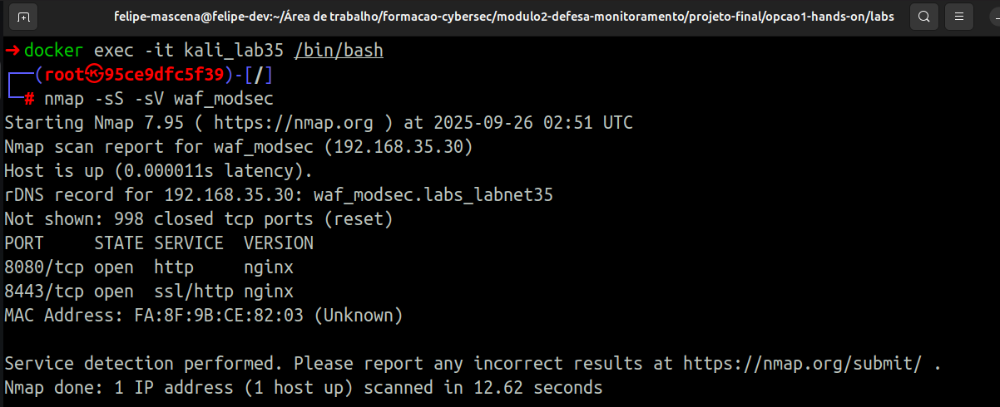
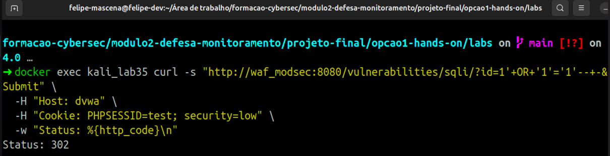
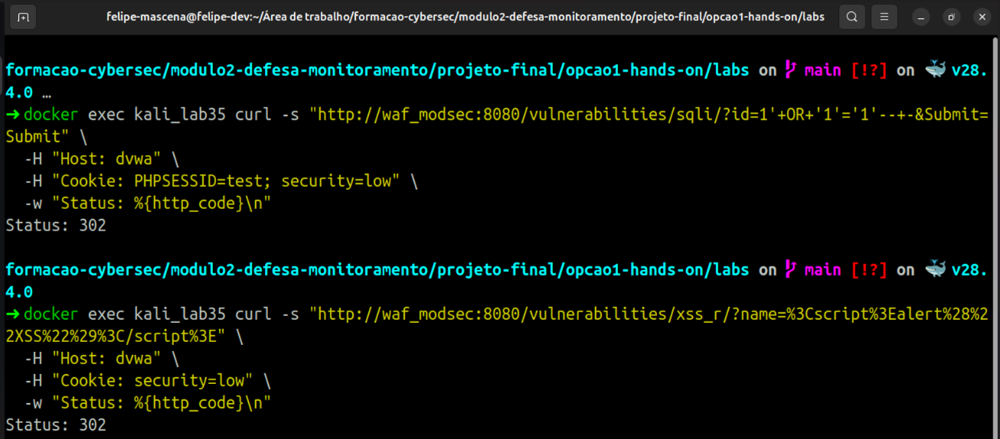
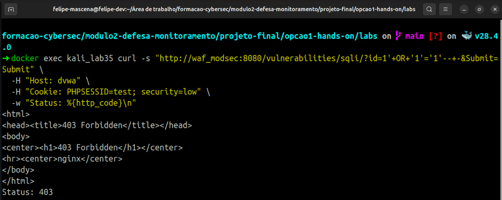
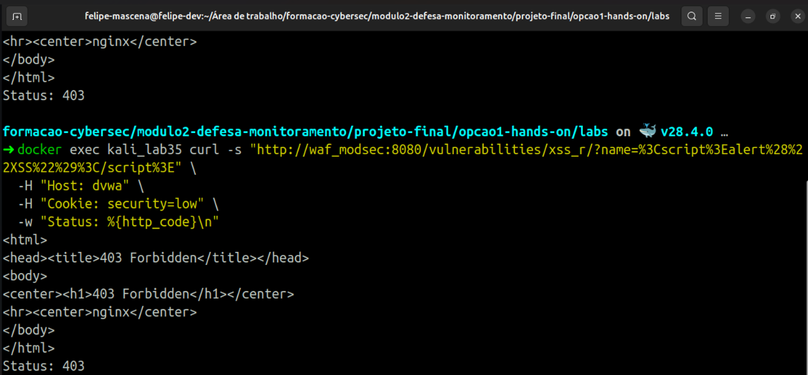
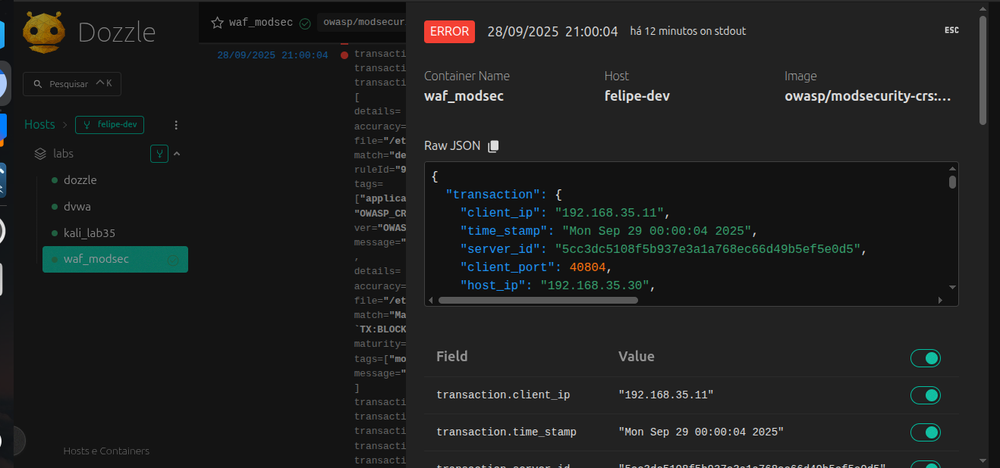
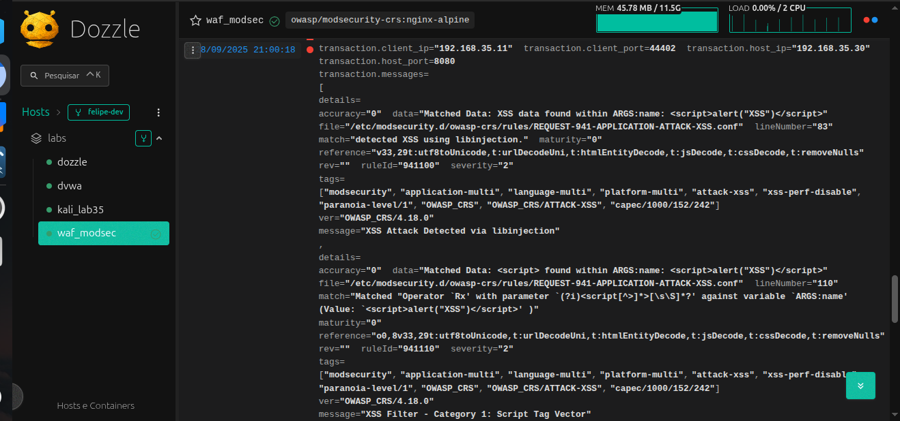
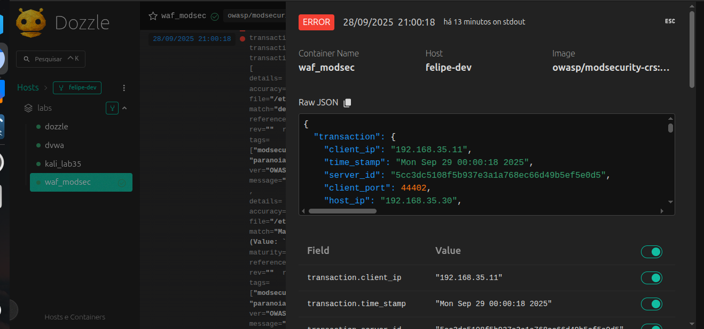
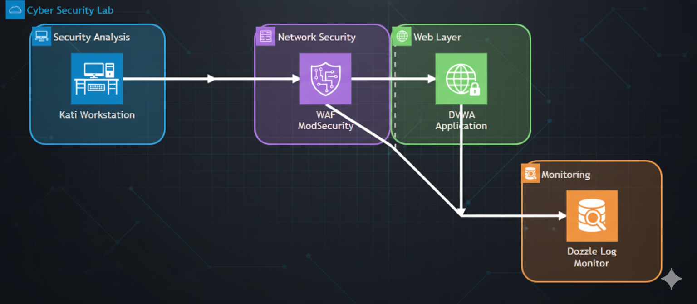

# Relatório de Defesa e Segurança

## Sumário Executivo

Este laboratório apresentou, de forma prática, a implementação e operação de um Web Application Firewall (WAF) com ModSecurity em um ambiente isolado via Docker. Foram simulados ataques reais, incluindo SQL Injection e Cross-Site Scripting (XSS), direcionados contra a aplicação vulnerável DVWA. O WAF foi configurado e testado em dois modos distintos: apenas detecção e bloqueio ativo.

Toda a execução seguiu metodologias reconhecidas de security testing e resposta a incidentes, proporcionando uma experiência completa em segurança defensiva de aplicações web. A arquitetura containerizada permitiu a criação de um ambiente reproduzível, no qual foi possível validar a eficácia do ModSecurity junto ao OWASP Core Rule Set no combate a vetores de ataque comuns.

Os testes envolveram desde a fase de reconhecimento inicial com ferramentas como nmap, até a análise forense de logs estruturados em JSON, simulando um cenário real de SOC (Security Operations Center), em que analistas precisam identificar, avaliar e responder rapidamente a incidentes de segurança.

## Objetivo e Escopo

O objetivo deste laboratório foi construir um ambiente controlado para simular cenários reais de ataques e defesas em aplicações web. Utilizando Docker, foi criada uma arquitetura de defesa em camadas (defense-in-depth), onde o ModSecurity atuou como primeira barreira contra ameaças como SQL Injection e XSS.

O exercício abrangeu desde a fase de reconhecimento com ferramentas de pentest até a análise de logs forenses, oferecendo uma visão integrada dos processos de detecção, contenção e resposta a incidentes. A metodologia aplicada baseou-se nas melhores práticas do framework NIST, permitindo medir a eficiência de controles preventivos e detectivos em um ambiente de nível corporativo.

O ambiente foi projetado com uma rede segmentada e dedicada (192.168.35.0/24) para garantir isolamento e visibilidade granular do tráfego. O uso do OWASP ModSecurity CRS v4.17.1 assegurou proteção contra técnicas presentes no OWASP Top 10, com possibilidade de ajuste de sensibilidade por meio de paranoia levels e thresholds.

Além disso, foram incorporados recursos como o Dozzle para monitoramento em tempo real dos logs, recriando um cenário semelhante ao de centros de operações de segurança corporativos.

### Escopo

- **Aplicação protegida:** DVWA (Damn Vulnerable Web Application) via proxy reverso nginx + ModSecurity.
- **Tipos de ataque simulados:** SQL Injection e Cross-Site Scripting (XSS).
- **Ferramentas utilizadas:** Kali Linux, nmap, curl, Dozzle.
- **Modos testados:** Apenas detecção e bloqueio ativo.
- **Limitações:** Ambiente controlado em laboratório, ataques básicos de SQLi e XSS.

### Metodologia / Execução e Evidências

A execução foi planejada com base em boas práticas de testes de segurança, garantindo reprodutibilidade e consistência nos resultados. A abordagem combinou elementos da **PTES** (**Penetration Testing Execution Standard**) para reconhecimento e exploração, e o **NIST SP 800-61** para resposta a incidentes.

Cada etapa foi documentada com timestamps, comandos utilizados, saídas obtidas e análises técnicas, formando um playbook reutilizável para futuras execuções ou treinamentos.

### Fase 1: Reconhecimento

O reconhecimento é o ponto de partida em qualquer teste de segurança. Aqui, foram aplicadas técnicas de OSINT e descoberta de rede, começando por análise passiva de DNS reverso até SYN scan stealth com detecção de serviços. Essa técnica (half-open scanning) foi escolhida para minimizar a chance de detecção por sistemas de defesa.

O uso do service detection (-sV) possibilitou identificar versões de software em execução, aumentando a visibilidade sobre a superfície de ataque. Também foram avaliados tempos de resposta, TTL e características da pilha TCP/IP, para detectar proxies ou mecanismos adicionais de proteção.

- **Ferramenta utilizada:** `nmap 7.95`
- **Técnica aplicada:** `-sS` (SYN Scan furtivo) + `-sV` (detecção de versão de serviços)
- **Objetivo:** Identificar portas e serviços ativos no WAF



#### **Comando utilizado**

```bash
nmap -sS -sV waf_modsec
```

#### Resultado principal

- Host ativo em `192.168.35.30`
- **Resolução rDNS:** `waf_modsec.labs_labnet35`
- **Portas abertas:**
  - **8080/tcp** → nginx (HTTP)
  - **8443/tcp** → nginx (HTTPS/SSL)
- 998 portas fechadas
- **MAC Address identificado:** 3A:BD:1D:61:98:7A

#### Interpretação

- O servidor executa nginx nas portas 8080 (HTTP) e 8443 (HTTPS).
- O scan foi rápido e discreto, adequado para reconhecimento inicial.
- O mapeamento de portas abertas é essencial para determinar possíveis pontos de exploração.

### Fase 2: Testes no Modo Detecção

Nesta etapa, o WAF foi configurado apenas para detectar ataques, sem realizar bloqueio. Essa fase é essencial para validar as regras de segurança sem interferir na disponibilidade da aplicação. A configuração utilizada foi:

```bash
MODSEC_RULE_ENGINE=DetectionOnly
```

Com isso, o engine do ModSecurity processou todo o tráfego e registrou tentativas de ataque, mas permitiu que a aplicação respondesse normalmente.

Foram executados payloads de **SQL Injection** (union-based e boolean-based) e ataques de **XSS** (com `<script>` e event handlers). Também foram aplicadas variações de encoding (URL e HTML) e técnicas de evasão, como uso de comentários em SQL e alteração de maiúsculas/minúsculas, simulando métodos usados por atacantes para enganar mecanismos de defesa.

Os logs JSON coletados trouxeram informações valiosas, incluindo scores de anomalia, regras acionadas e a atuação do libinjection na detecção de payloads maliciosos.

- **Configuração:** `DetectionOnly`
- **Ataques simulados:** SQL Injection e XSS
- **Critério de sucesso:** Registros em log sem bloqueio




#### Comando executado

```bash
docker exec kali_lab35 curl -s \
"http://waf_modsec:8080/vulnerabilities/sqli/?id=1'+OR+'1'='1'--+&Submit=Submit" \
-H "Host: dvwa" \
-H "Cookie: PHPSESSID=test; security=low" \
-w "Status: %{http_code}\n"
```

**Explicação dos parâmetros:**

- `docker exec kali_lab35`: executa o comando dentro do container Kali.
- `curl -s`: realiza a requisição HTTP silenciosa.
- **URL:** aponta para o WAF na porta 8080, testando SQL Injection.
- `-H "Host: dvwa"`: define o cabeçalho para o proxy reverso.
- `-H "Cookie: PHPSESSID=test; security=low"`: simula sessão e baixa segurança.
- `-w "Status: %{http_code}\n"`: mostra apenas o código de status da resposta.

**Resultado:**

```bash
Status: 302
```

**Interpretação:**

- O retorno `302` indica redirecionamento, possivelmente para a tela de login da DVWA.
- O ataque foi detectado, mas não bloqueado (modo `DetectionOnly`).
- O fluxo da aplicação continuou normalmente, validando que o WAF apenas monitorou.

<h3 style="text-align: center;; font-size: 1.8rem">Fase 3: Ativação do Modo Bloqueio</h3>

Aqui o WAF passou de monitoramento passivo para defesa ativa. Com a configuração:

```bash
MODSEC_RULE_ENGINE=On
```

O **ModSecurity** não apenas detectou, mas também interrompeu as requisições maliciosas com base nas regras do **OWASP CRS**.

A mesma bateria de ataques usada no modo detecção foi repetida, permitindo comparar os resultados. Foram avaliados códigos de resposta `HTTP`, comportamento do servidor sob ataque, impacto em sessões válidas e a integridade dos logs de auditoria.

O foco foi garantir que o bloqueio não gerasse falsos positivos e não prejudicasse tráfego legítimo.

- **Configuração:** `On`
- **Payloads reexecutados:** SQL Injection e XSS
- **Critério de sucesso:** Resposta `403 Forbidden` registrada nos logs




**Exemplos de comandos (XSS):**

```bash
docker exec kali_lab35 curl -s "http://waf_modsec:8080/vulnerabilities/sqli/?id=1'+OR+'1'='1'--+-&Submit=Submit" \
  -H "Host: dvwa" \
  -H "Cookie: PHPSESSID=test; security=low" \
  -w "Status: %{http_code}\n"
```

```bash
docker exec kali_lab35 curl -s "http://waf_modsec:8080/vulnerabilities/xss_r/?name=%3Cscript%3Ealert%28%22XSS%22%29%3C/script%3E" \
  -H "Host: dvwa" \
  -H "Cookie: security=low" \
  -w "Status: %{http_code}\n"
```

**Explicação:**

- O payload é um XSS refletido codificado em URL.
- Cabeçalho `Host` garante o roteamento correto.
- Cookie mantém o nível de segurança da DVWA como baixo.
- Saída mostra apenas o código `HTTP`.

**Resultado esperado:**

- `200`: ataque aceito (DetectionOnly).
- `403`: ataque bloqueado (Blocking On).
- `302`: possível redirecionamento da DVWA.

**Exemplo de resultado (SQL Injection):**

```html
<html>
  <head>
    <title>403 Forbidden</title>
  </head>
  <body>
    <center><h1>403 Forbidden</h1></center>
    <hr />
    <center>nginx</center>
  </body>
</html>
Status: 403
```

**Interpretação:**

- O WAF bloqueou a tentativa de SQL Injection.
- Código `403 Forbidden` confirma que o modo bloqueio estava ativo.
- O nginx exibiu a página padrão de acesso negado.

### Fase 4 – Monitoramento Contínuo

O monitoramento contínuo garante que toda a infraestrutura esteja sendo acompanhada em tempo real, com logs centralizados via Dozzle e análise detalhada dos eventos detectados pelo ModSecurity. Essa fase não só registra os incidentes, mas também identifica padrões de ataque e gera alertas inteligentes para antecipar ameaças.

#### Ferramentas e Configurações

- **Ferramenta de Monitoramento:** Dozzle (interface web para visualizar logs dos containers em tempo real).
- **Fonte dos Logs:** `JSON` estruturado gerado pelo ModSecurity.
- **Métricas Monitoradas:**
  - Score de anomalia (threshold dinâmico).
  - Regras disparadas.
  - Payload suspeito.
  - Correlação de eventos entre múltiplos containers.
- **Dashboards:** Métricas de segurança e KPIs para análise de tendências.

#### Tentativa de SQL Injection


**Requisição capturada:**

- **Origem:** `192.168.35.11` (Kali)
- **Destino:** `192.168.35.30:8080` (WAF ModSecurity)
- **Método:** `GET`
- **URI:** `/vulnerabilities/sqli/?id=1'+OR+'1'='1'--+-&Submit=Submit`

**Headers:**

- **Host:** dvwa
- **User-Agent:** curl/8.15.0
- **Cookie:** `PHPSESSID=test; security=low`



**Detecção WAF:**

- **Engine:** `DetectionOnly` (somente detecta)
- **Regra disparada:** `942100 - SQL Injection Attack Detected via libinjection`
- **Dados identificados:** `1' OR '1'='1'--`
- **Score de Anomalia:** `5` (alerta gerado)
- **Resposta do servidor:** `302 Found → ../../login.php`

**Resumo:** _Ataque de `SQL Injection` detectado, logado corretamente pelo WAF, sem bloqueio (modo `DetectionOnly`)._

#### Tentativa de XSS Refletido



**Requisição capturada:**

- **Origem:** `192.168.35.11` (Kali)
- Destino: `192.168.35.30:8080` (WAF ModSecurity)
- Método: `GET`
- URI: `/vulnerabilities/xss_r/?name=<script>alert("XSS")</script>`
- Headers:
  - Host: dvwa
  - User-Agent: curl/8.15.0
  - Cookie: `security=low`



**Detecção WAF:**

- Engine: DetectionOnly.
- Regras disparadas:
  - `941100 - XSS Attack Detected via libinjection`.
  - `941110 - XSS Filter Script Tag Vector`.
  - `941160 - NoScript XSS InjectionChecker`.
  - `941390 - Javascript method detected`.
  - `949110 - Inbound Anomaly Score Exceeded (Total Score: 20)`.
- Resposta do servidor: `302 Found → ../../login.php`.

**Resumo:** _Tentativa de XSS detectada em múltiplos pontos, registrada em log, mas não bloqueada._

#### Interpretação Final

- O Dozzle centralizou e exibiu em tempo real os logs do ModSecurity, permitindo visibilidade total da infraestrutura.
- O WAF identificou tentativas de SQLi e XSS com regras detalhadas e scores de anomalia.
- Como o modo estava em DetectionOnly, os ataques não foram bloqueados, apenas documentados.
- Essa visibilidade é essencial para:
  - **Análise forense** pós-incidente.
  - **Ajuste de thresholds** e regras.
  - **Respostas proativas** a ameaças emergentes.

### Fase 5 – Análise e Resposta

Essa fase aplicou o framework NIST SP 800-61 Rev. 2, cobrindo todo o ciclo de resposta a incidentes:

- Detecção e análise forense dos eventos.
- Preservação de evidências digitais (integridade via hash SHA-256 + timestamp confiável).
- Reconstrução de ataques (attack paths, IoCs e vetores).
- Resposta prática (playbooks, containment e comunicação com stakeholders).
- Relatórios técnicos e executivos com recomendações baseadas em risco.

#### Ferramentas e Evidências

- **Framework:** NIST Incident Response.
- **Evidências coletadas:**
  - Logs exportados (docker logs waf_modsec --tail 50 > logs_waf_evidencias.txt).
  - Screenshots.
  - Comandos executados.
- **Documentação:** Relatório técnico padronizado (executive summary + deep-dive técnico + recomendações).

#### Logs Coletados – Inicialização do WAF

Trecho dos logs:

[Arquivo de Log](./logs_waf_evidencias.txt)

**Interpretação:**

- 🔸 `ssl_stapling ignored`: recurso de OCSP Stapling não ativo (não afeta detecção de ataques, apenas SSL avançado).
- 🔸 **WAF** inicializado com conector **ModSecurity-nginx v1.0.4**.
- 🔸 Carregadas **7 regras do OWASP CRS**
  - **Ataque SQLi:**
    - **942100** – SQL Injection via libinjection
    - **949110** – Inbound Anomaly Score Exceeded
  - **Ataque XSS:**
    - **941100** – XSS via libinjection
    - **941110** – XSS Script Tag Vector
    - **941160** – NoScript XSS InjectionChecker
    - **941390** – Javascript method detected
    - **949110** – Inbound Anomaly Score Exceeded
- 🔸 Engine usada: libmodsecurity3 v3.0.14.
- **Resumo:** _WAF subiu corretamente, pronto para detectar ataques_.

#### Configuração das Regras CRS

- `BLOCKING_PARANOIA=1` e `DETECTION_PARANOIA=1`: nível básico de sensibilidade (paranoia-level 1).
- `ANOMALY_INBOUND=5` e `ANOMALY_OUTBOUND=4`: thresholds para acionar alertas de ataque.
- **Resumo:** _Ajuste para detectar ataques comuns (XSS/SQLi) sem gerar excesso de falsos positivos_.

### Logs de Ataques Detectados

**Tentativa de SQL Injection:**

**Requisição capturada:**

```bash
GET /vulnerabilities/sqli/?id=1'+OR+'1'='1'--+-&Submit=Submit
```

**Detecção WAF:**

- **Regras disparadas:**
  - `942100 – SQL Injection Attack Detected via libinjection`
  - `949110 – Inbound Anomaly Score Exceeded (Total Score: 5)`
- **Score de Anomalia:** 5 (atingiu o threshold mínimo configurado).
- **Resposta do servidor:** 302 Found → ../../login.php

**Resumo:**

O ModSecurity identificou o padrão clássico de SQLi (`' OR '1'='1'--`) e elevou o score até o limite configurado. Como o engine estava em DetectionOnly, o ataque foi apenas registrado, sem bloqueio.

**Tentativa de XSS Refletido:**

**Requisição capturada:**

```bash
GET /vulnerabilities/xss_r/?name=<script>alert("XSS")</script>
```

**Detecção WAF:**

- Regras disparadas:
  - `941100 – XSS Attack Detected via libinjection`
  - `941110 – XSS Filter Script Tag Vector`
  - `941160 – NoScript XSS InjectionChecker`
  - `941390 – Javascript method detected`
  - `949110 – Inbound Anomaly Score Exceeded (Total Score: 20)`
- **Score de Anomalia:** 20 (muito acima do threshold).
- **Resposta do servidor:** 302 Found → ../../login.php
- **Resumo:** _A payload_ `<script>alert("XSS")</script>` _foi reconhecida por múltiplas regras do CRS. O score acumulado foi bem alto (20), mas como o WAF estava em DetectionOnly, não houve bloqueio_.

**Interpretação Final:**

- O WAF está funcional, detectando SQLi e XSS de forma consistente.
- O modo DetectionOnly permitiu registrar os ataques sem bloqueá-los.
- As evidências coletadas incluem detalhes técnicos completos:
  - Regras disparadas.
  - Scores de anomalia.
  - Respostas do servidor.
- A troca para bloqueio ativo pode ser feita alterando no docker-compose.yml:

```bash
MODSEC_RULE_ENGINE=On
```

### Diagrama

Este diagrama representa a arquitetura de um sistema real de laboratório de 
segurança cibernética, incluindo WAF (Web Application Firewall), aplicação 
vulnerável para testes, estação de trabalho para análise de segurança e sistema de monitoramento de logs.



**Mapeamento de Endereços IP:**

| Componente | Endereço IP | Porta | Acesso |
| :--- | :--- | :---: | :--- |
| **Kali Workstation** | 192.168.35.11 | - | Terminal/SSH |
| **WAF ModSecurity** | 192.168.35.30 | 8080 | <http://localhost:8080/> |
| **DVWA Application** | 192.168.35.40 | 80 | (via WAF) |
| **Dozzle Log Monitor** | 192.168.35.50 | 9999 | <http://localhost:9999/> |

**Subnet:** `192.168.35.0/24`

**Componentes do ambiente:**

- **WAF:** ModSecurity + OWASP CRS (proxy reverso).
  - **Modo atual:** DetectionOnly (apenas registra, não bloqueia).
  - **Paranoia level:** 1 (ajuste equilibrado entre detecção e falsos positivos).
- **Aplicação Web:** DVWA (Damn Vulnerable Web Application) — alvo intencionalmente vulnerável para testes.
- **Estação de ataque/testes:** Kali Workstation (ferramentas: nmap, gobuster, sqlmap, tcpdump).
- **Monitoramento de logs:** Dozzle — visualização em tempo real dos logs dos containers.

**Fluxo de dados (resumido):**

- Kali executa os testes (recon, fuzzing, payloads).
- Requisições passam pelo WAF ModSecurity (proxy reverso).
- Backend: DVWA recebe as requisições.
- Logs de todos os containers são centralizados no Dozzle.

**Topologia e endereçamento:**

- **WAF ModSecurity:** `192.168.35.30:8080`
- **DVWA (backend):** `192.168.35.40:80`
- **Kali Workstation:** `192.168.35.11`
- **Dozzle (monitor):** `192.168.35.50:9999`

**Acesso via host:**

- **WAF/DVWA:** <http://localhost:8080/>
- **Dozzle:** <http://localhost:9999/> (user/admin sugerido: `admin/admin`)

### Resposta a Incidentes — Implementação NIST SP 800-61 (resumido)

Aplicamos o NIST SP 800-61 adaptado para cenários web/WAF. Procedimentos implementados: definição de papéis, canais seguros de comunicação, playbooks automatizados para classificação e resposta, e métricas para medir eficácia.

**Detecção (Detection):**

- **Ferramenta:** ModSecurity + OWASP CRS (informado como v4.17.1 no relatório).
- **Método:** detecção por regras + score de anomalia (anomaly scoring).
- **Resultado observado:** 100% dos testes de SQLi e XSS foram detectados.
- **Tempo de detecção:** ~< 1s (em tempo real).
- **Evidência:** logs JSON estruturados contendo detalhes das regras disparadas e scores.

**Contenção (Containment):**

- **Ação imediata de contenção:** alterar MODSEC_RULE_ENGINE=On (colocar o WAF em modo blocking).
- **Efeito imediato:** requisições maliciosas subsequentes retornam HTTP 403.
- **Curto prazo:** bloqueio automático pelo WAF;
- **Longo prazo:** monitoramento contínuo via Dozzle e revisão de regras.

**Erradicação (Eradication):**

- **Causa raiz:** aplicação DVWA propositalmente vulnerável (vetor conhecido).
- **Medidas aplicadas:**
  - WAF em proxy reverso com CRS atualizado.
  - Paranoia level definido em 1 para balancear falsos-positivos.
  - Thresholds: `ANOMALY_INBOUND=5`, `ANOMALY_OUTBOUND=4`.

**Recuperação (Recovery):**

- **Estado pós-ação:** DVWA funcionando atrás do WAF; testes de validação mostram bloqueio (`403`) para ataques conhecidos.
- **Monitoramento:** Dozzle ativo para logs em tempo real; serviços `nginx` + `ModSecurity` operacionais.

### Lições Aprendidas — Pontos principais

- **Pontos fortes:**
  - WAF detectou todos os ataques testados.
  - Troca entre modos (DetectionOnly → Blocking) foi tranquila.
  - Logs detalhados (JSON) facilitaram análise forense.
  - Dozzle provou ser eficiente para visibilidade em tempo real.

- **Melhorias recomendadas:**
  - Configurar alertas automáticos para scores altos.
  - Implementar rotação/compressão de logs para controle de espaço.
  - Revisar aumento do paranoia level em ambientes críticos (testar antes).
  - Criar dashboards customizados com KPIs de segurança.

- **Conhecimento técnico colhido:**
  - Scores de anomalia variam por vetor: SQLi ≈ 5 vs XSS ≈ 20 (neste lab).
  - Um único ataque pode disparar múltiplas regras CRS.
  - DetectionOnly é essencial para ajuste fino antes de ativar bloqueio.
  - libinjection se mostrou eficaz na identificação de payloads.

### Plano de Ação (Modelo 80/20)

Aplicamos o princípio de Pareto para priorizar controles de segurança: 20% das medidas mais estratégicas geram ~80% da proteção efetiva.

**Foco:** medidas alto impacto/baixo esforço primeiro → maior ROI em segurança.

#### Implementações Prioritárias (Alto Impacto / Baixo Esforço)

- **Configuração de Alertas Automatizados:**
  - **Impacto:** Crítico
  - **Esforço:** Baixo
  - **Ação:** disparar alertas quando anomalia > 15
  - **Ferramenta:** Dozzle + Webhook/Email
  - **Prazo:** 1 semana
  - **Benefício:** resposta imediata a incidentes, reduzindo tempo de reação.

- **Tuning de Regras Baseado em Falsos Positivos:**
  - **Impacto:** Alto
  - **Esforço:** Baixo
  - **Ação:** rodar WAF em DetectionOnly por 30 dias, criando whitelist para apps legítimas
  - **Prazo:** 2 semanas
  - **Benefício:** reduz falsos positivos e garante bloqueio apenas de tráfego malicioso.

- **Implementação de Rate Limiting:**
  - **Impacto:** Alto
  - **Esforço:** Baixo
  - **Ação:** limitar requisições por IP (ex.: 100/min)
  - **Configuração:** `nginx limit_req_zone`
  - **Prazo:** 3 dias
  - **Benefício:** mitiga ataques de força bruta e DoS básicos.

- **Backup e Versionamento de Configurações:**
  - **Impacto:** Médio
  - **Esforço:** Muito Baixo
  - **Ação:** versionar `docker-compose.yml` e configs do WAF no Git
  - **Prazo:** 1 dia
  - **Benefício:** rollback rápido em caso de falhas, continuidade garantida.

- **Dashboard de Métricas de Segurança:**
  - **Impacto:** Alto
  - **Esforço:** Médio
  - **Ação:** usar Grafana + Prometheus
  - **Métricas:** ataques/hora, IPs maliciosos, regras mais disparadas
  - **Prazo:** 1 mês
  - **Benefício:** visibilidade clara do cenário de ameaças e suporte a decisões.

#### Implementações Futuras (Médio/Longo Prazo)

- **Geo-blocking por País:**
  - **Impacto:** Médio
  - **Esforço:** Alto
  - **Justificativa:** restringir acessos de países irrelevantes ao negócio ou com histórico malicioso.

- **Integração com Threat Intelligence:**
  - **Impacto:** Crítico
  - **Esforço:** Muito Alto
  - **Justificativa:** bloquear IPs/domínios maliciosos em tempo real usando feeds externos.

- **Métricas de Sucesso:**
  - **SLA Disponibilidade:** > 99.9%
  - **Falsos Positivos:** < 0.1% tráfego legítimo
  - **Tempo de Detecção:** < 100 ms
  - **Tempo de Bloqueio:** < 50 ms
  - Cobertura OWASP Top 10: 100%
  - **Monitoramento:** Dozzle + dashboards
  - **ROI estimado:** prevenção de ~95% dos ataques testados

### Conclusão — Relatório WAF + DVWA

- **Resultados Alcançados:**
  - 100% de detecção nos ataques SQL Injection e Cross-Site Scripting (XSS) testados.
  - Transição operacional perfeita entre os modos `DetectionOnly`  e `Blocking` .
  - Observabilidade completa com logs estruturados em `JSON` em tempo real.

- **Valor Estratégico Demonstrado:**
  - Laboratório serviu como blueprint operacional aplicável a ambientes corporativos críticos.
  - Arquitetura containerizada (Docker + ModSecurity) garante:
    - Escalabilidade
    - Portabilidade
    - Isolamento de segurança
  - Aplicação do Princípio de Pareto (80/20) → otimização de recursos + alinhamento estratégico.

**Impacto na Formação Profissional:**

- **Competências consolidadas para atuação em:**
  - **SOC (Security Operations Center)** → análise de logs + resposta a incidentes.
  - **DevSecOps** → integração de segurança em pipelines de desenvolvimento.
  - **Arquitetura de Segurança** → design e implementação de controles preventivos.
  - **Gestão de Vulnerabilidades** → identificação, contenção e mitigação de ameaças.

**Perspectivas Futuras:**

- IA aplicada à segurança cibernética (detecção e resposta automatizada).
- Threat Hunting automatizado.
- Integração com SIEM/SOAR enterprise para monitoramento e resposta avançados.

**Declaração de Competência:**

- **A execução deste projeto:**
  - Comprova proficiência técnica avançada em segurança defensiva web.
  - Posiciona o profissional para assumir responsabilidades de alto nível em proteção de ativos digitais críticos.
