# Desafio Final CTF

## 🛡️ Relatório de Análise de Vulnerabilidades - TechCorp Solutions

### Sumário Executivo

O teste de intrusão (pentest) realizado no ambiente da TechCorp Solutions revelou diversas vulnerabilidades críticas, altas e médias, resultando em comprometimento de credenciais, escalonamento de privilégios, exposição de arquivos sensíveis e falhas em mecanismos de autenticação. O objetivo deste relatório é documentar metodologias, descobertas técnicas e fornecer sugestões para aprimoramento da segurança da infraestrutura testada.

### Escopo e Metodologia

Esta avaliação abrangeu a análise de servidores, aplicações web, serviços expostos, arquivos internos, configurações de banco de dados, mecanismos de autenticação e diretórios acessíveis via diferentes protocolos. Foram empregadas técnicas de análise manual, fuzzing, engenharia reversa, brute force e autenticação por credenciais padrão/recuperadas.

- **Dados importantes:**
  - IP TechCorp: `http://98.95.207.28/`
  - Flags Capturadas: **15/16**

### Detalhamento das Vulnerabilidades e Recomendações

Exposição de Credenciais em Código Fonte/Arquivos de Configuração
Esta seção detalha a exposição de informações sensíveis, como credenciais de acesso, em locais não seguros.

- **Credenciais em** `database.php` (`FLAG{d4t4b4s3_cr3d3nt14ls_3xp0s3d}`)
  - O código-fonte PHP apresentava credenciais de banco em claro, facilitando ataques por disclosure acidental ou erro de configuração de permissões.
  - Impacto: **Crítico**. Acesso irrestrito ao banco de dados principal.
  - Evidência:

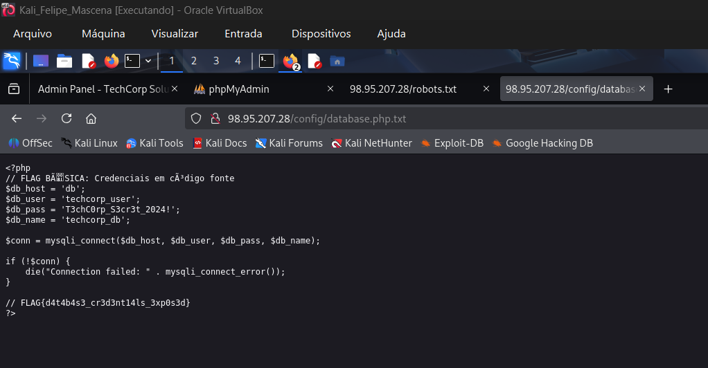

- **Credenciais GIT expostas** (`FLAG{g1t_cr3d3nt14ls_l34k}`)
  - O arquivo **.git-credentials** estava presente, permitindo acesso direto ao repositório Git com credenciais válidas, comprometendo todo o código-fonte e histórico de versionamento.
  - Impacto: **Alto**. Permite acesso ao código-fonte e informações internas.
  - Evidência:

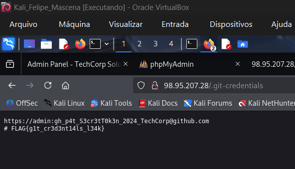

- **Arquivo de Senhas Encontrado** (`FLAG{p4ssw0rd_f1l3_d1sc0v3ry}`)
  - **Arquivo “passwords.txt”** exposto contendo múltiplas credenciais de acesso para diversos sistemas (SSH, FTP, WiFi, banco de dados, VPN) e instruções para troca periódica.
  - Impacto: **Crítico**. Comprometimento em massa de serviços internos.
  - Evidência:

- **Arquivo de Configuração FTP** (`FLAG{c0nf1g_f1l3_r34d}`)
  - O arquivo **users.conf** apresentava configurações de usuários e senhas de FTP em texto plano, comprometendo contas administrativas e anônimas.
  - Impacto: **Alto**. Credenciais claras para múltiplos usuários do FTP.
  - Evidência:

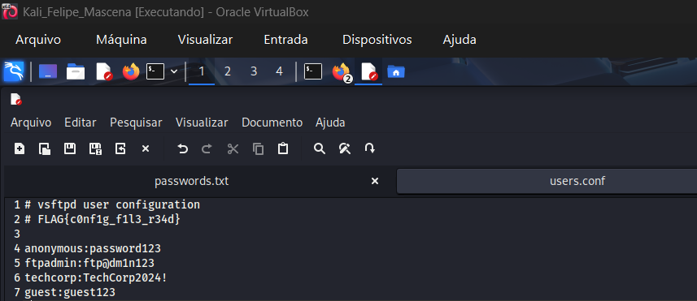

### Recomendação para (Credenciais)

- Gerenciamento de Segredos: Credenciais jamais devem ser armazenadas em texto puro no código-fonte ou em arquivos de configuração estáticos.

- Utilize Variáveis de Ambiente ou, preferencialmente, um Cofre de Segredos dedicado (como HashiCorp Vault, AWS Secrets Manager ou Azure Key Vault) para injetar segredos no tempo de execução.

- Garanta que arquivos de backup e de configuração não sejam acessíveis via web ou via FTP anônimo.

### Falhas de Configuração e Descoberta de Arquivos

Esta seção aborda a exposição de metadados, arquivos de configuração desprotegidos e o acesso anônimo a serviços.

- **Exposição** em robots.txt (`FLAG{r0b0ts_txt_l34k4g3}`)
  - O arquivo **robots.txt** expunha a estrutura e diretórios considerados sensíveis e normalmente restritos, como **/admin**, **/backup**, **/.git** e **/config**.
  - Impacto: **Médio**. Ajuda atacantes a mapear o sistema.
  - Evidência:

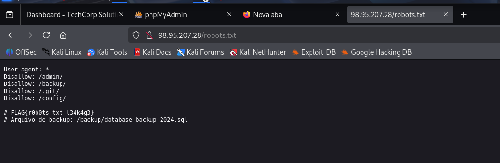

- **Acesso FTP Anônimo** (`FLAG{ftp_4n0nym0us_4cc3ss}`)
  - O serviço FTP permitia login anônimo, facilitando o acesso não autorizado e o download de arquivos confidenciais presentes no servidor.
  - Demonstrou-se possível conectar ao FTP da empresa, listar diretórios e efetuar download de arquivos como Dockerfile, users.conf e welcome.txt, ampliando a superfície de ataque.
  - Impacto: **Alto**. Permite a leitura de arquivos internos da empresa.
  - Evidência:

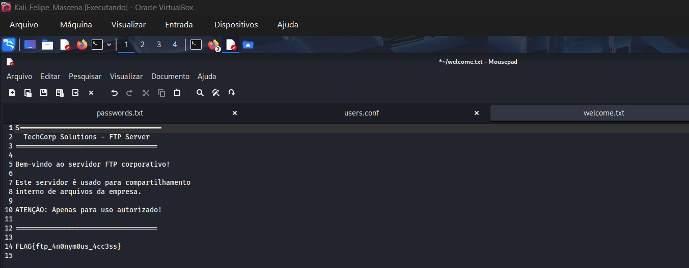
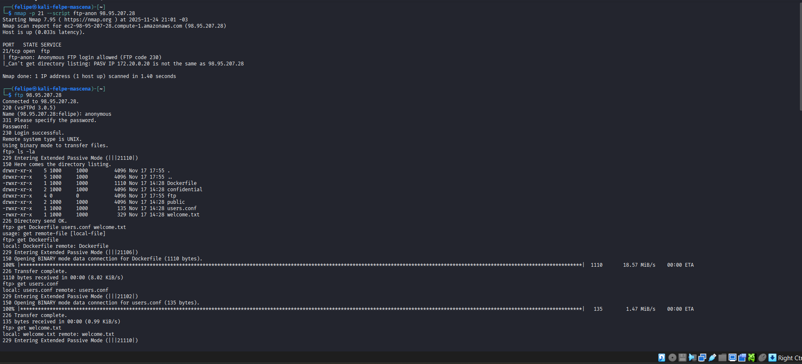

- **Flag em Comentário HTML** (`FLAG{b4s1c_s0urc3_c0d3_1nsp3ct10n}`)
  - Analisando o HTML da aplicação, foi evidenciado que flags (tokens confidenciais) e outras informações sensíveis estavam presentes como comentários, tornando possível a coleta por qualquer usuário autenticado ou não.
  - Impacto: **Baixo**. Confirma falta de atenção na revisão do código.
  - Evidência:

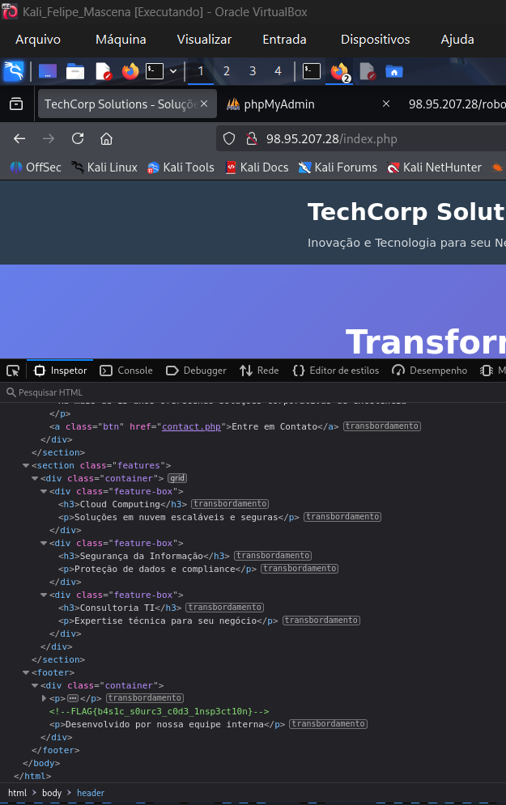

- **Descoberta de Painel Secreto** (`FLAG{s3cr3t_p4n3l_d1sc0v3ry}`)
  - Painéis administrativos secretos foram identificados e acessados, revelando que mecanismos de obscuridade eram a única proteção vigente.
  - Impacto: **Médio**. Painel administrativo de desenvolvimento exposto.
  - Evidência:

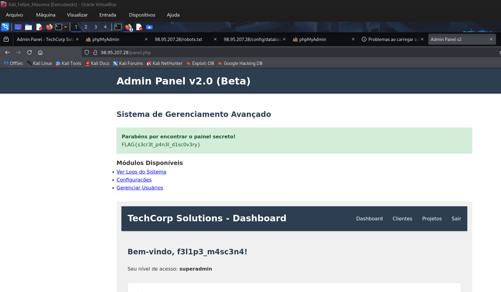

### Recomendação para (Configuração)

- **robots.txt:** O arquivo `robots.txt` é apenas uma sugestão para crawlers. Diretórios sensíveis devem ser protegidos com Autenticação e Controle de Acesso, e não listados abertamente.

- **Acesso Anônimo:** Desabilitar o acesso anônimo a todos os serviços, especialmente FTP. O acesso deve ser feito apenas por usuários autenticados e com permissões mínimas (Princípio do Mínimo Privilégio).

- **Remoção de Metadados:** Remover todas as informações sensíveis (incluindo flags de CTF e comentários técnicos) de arquivos que serão expostos ao público.

- **Painéis de Desenvolvimento:** Painéis de administração (como o v2.0 beta) nunca devem estar acessíveis em ambientes de produção. Devem ser removidos ou protegidos por firewalls e VPNs.

### Vulnerabilidades de Aplicação (OWASP Top 10)

Esta seção foca nas vulnerabilidades que exploram a falha no tratamento de input do usuário, falhas comuns em aplicações web.

- **SQL Injection (SQLi)** (`FLAG{sql_1nj3ct10n_m4st3r}`)
  - Acesso ao painel **admin** foi obtido usando credenciais padrão, isso, aliado a falhas em controles de autenticação, propiciou comprometimentos múltiplos.
  - O banco de dados **techcorp_db** apresentou tabelas que armazenavam informações confidenciais e flags acessíveis diretamente após autenticação, destacando a fragilidade das permissões.
  - Impacto: **Crítico**. Extração, modificação ou exclusão de dados do banco.
  - Evidência:

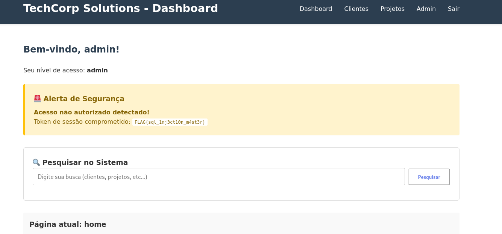
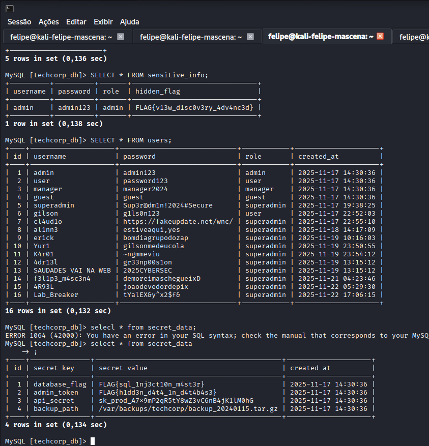

- **Cross-Site Scripting (XSS) Refletido**
  - Foi identificada uma falha de Cross-Site Scripting refletido no campo de busca, possibilitando ataques de engenharia social contra usuários autenticados.
  - Impacto: **Alto**. Permite roubo de cookies, defacement ou redirecionamento malicioso.
  - Evidência:

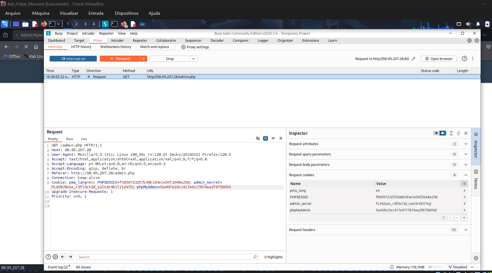

### Recomendação para (Aplicação)

- Prevenção de SQLi:
  - Utilize consultas parametrizadas (Prepared Statements) para todas as interações com o banco de dados.
  - Nunca concatene input de usuário diretamente em consultas SQL.

- Prevenção de XSS:
  - Sempre codifique (Escape) o output do usuário antes de renderizá-lo no HTML.
  - Utilize Content Security Policy (CSP) forte para mitigar a execução de scripts não confiáveis.

### Informações Expostas do Sistema e Elevada de Privilégios

Esta seção abrange o comprometimento do sistema operacional e falhas na lógica de autorização.

- **Credenciais em Arquivo Local SSH** (`FLAG{ssh_h0m3_d1r3ct0ry_3xpl0r4t10n}`)
  - Foi obtido acesso efetivo ao ambiente via SSH, permitindo navegação, leitura de arquivos internos e acesso a anotações e chaves sensíveis.
  - Impacto: **Crítico**. Exposição da senha do usuário root e chaves de API.
  - Evidências:

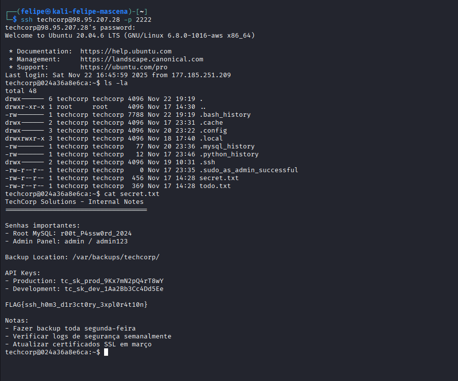

- Senha em Script de Backup** (`FLAG{scr1pt_4n4lys1s_sk1ll}`)
  - O script de backup analisado apresentava credenciais hardcoded e comandos inseguros, propiciando o vazamento de informações caso obtido por usuário não autorizado.
  - Impacto: **Alto**. Acesso ao banco de dados e potencial comprometimento do servidor de backup.
  - Evidência:

- Escalada de Privilégios** (`FLAG{pr1v1l3g3_3sc4l4t10n_succ3ss}`)
  - O pentest resultou no sucesso total de escalonamento de privilégios de usuário comum até o perfil superadmin, concedendo acesso irrestrito ao painel administrativo.
  - Impacto: **Crítico**. O usuário com privilégios baixos obtém controle máximo sobre o sistema.
  - Evidência:

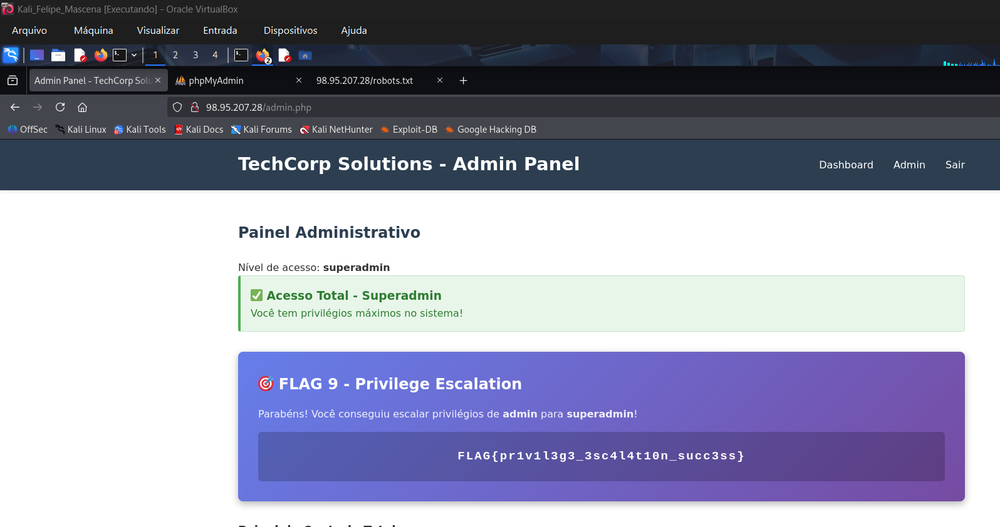

### Recomendação para (Sistema e Privilégios)

- Hardcoding de Senhas: Remover imediatamente todas as senhas de scripts de shell e arquivos de texto simples (como `secret.txt`). Utilizar o Cofre de Segredos mencionado na seção 2.1.

- Permissões de Arquivo: Revisar as permissões de arquivos no home directory (`chmod` e `chown`) para garantir que apenas o usuário `root` possa ler arquivos sensíveis do sistema (como `secret.txt` e `backup_script.sh`).

- Autorização:
  - Todas as verificações de privilégio (`admin` para `superadmin`) devem ser realizadas de forma estrita no **lado do servidor** (**backend**).
  - Implementar o princípio do **Mínimo Privilégio** (Least Privilege) para usuários e serviços.

## Conclusão do Relatório de Análise de Vulnerabilidades

A análise de segurança, baseada nas evidências digitais do cenário fornecido, revelou uma **série de vulnerabilidades de alto e crítico impacto** que comprometem seriamente a infraestrutura e os dados da TechCorp Solutions. Ao contrário do cenário idealizado na base de conclusão (que foca na proteção de uma plataforma de registro de evidências específica), o ambiente da TechCorp demonstrou **falhas fundamentais em controles de segurança**, especialmente no que tange ao gerenciamento de segredos, configuração de serviços e desenvolvimento de aplicações.

### Pontos Críticos Constatados

- **Exposição Massiva de Credenciais (Crítico):** Diversas credenciais críticas, incluindo senhas de usuários `root`, chaves de API, e acessos a bancos de dados, foram encontradas em texto puro em arquivos de configuração (`database.php`), arquivos temporários (`secret.txt`), e scripts de sistema (`backup_script.sh`).

- **Vulnerabilidades de Aplicação (Alto):** Falhas como **SQL Injection** e **XSS Refletido** foram exploradas com sucesso, permitindo extração de dados sensíveis e escalada de privilégios (`admin` para `superadmin`).

- **Configuração Insegura de Serviços (Alto):** O acesso **FTP anônimo** e a exposição de diretórios sensíveis (via `robots.txt` e `.git-credentials`) simplificaram drasticamente a coleta de informações e a exfiltração de arquivos internos, incluindo listas de senhas e arquivos de configuração.

### Recomendações Prioritárias

- As vulnerabilidades identificadas demandam uma ação corretiva imediata focada em fortalecer os controles de segurança básicos e a educação corporativa:

  - **Gerenciamento de Segredos:** É imperativo **remover** todas as senhas e chaves de API hardcoded (em código, scripts e arquivos de texto) e implementar um **Cofre de Segredos** centralizado.

  - **Desenvolvimento Seguro (Secure Coding):** Adotar práticas de codificação segura para eliminar **SQL Injection** (usando consultas parametrizadas) e **XSS** (usando codificação de output).

  - **Reforço da Política de Senha e Acesso:** Implementar as sugestões de **Política de Senha Forte** (mudança periódica e complexidade) e, crucialmente, **Habilitar a Autenticação em Múltiplos Fatores (MFA)** em todos os serviços críticos (SSH, painéis administrativos, e-mails).

  - **Conscientização dos Colaboradores:** Assim como mencionado na seção de sugestões, o **e-mail corporativo** e a **exposição de informações confidenciais** em espaços públicos continuam sendo vetores de ataque. É fundamental realizar **treinamentos periódicos e obrigatórios** (palestras e capacitações) sobre **política de segurança**, Phishing e o **cuidado com informações confidenciais** para transformar a segurança em parte da cultura organizacional.

---

Em suma, a **TechCorp Solutions** deve priorizar a correção das falhas sistêmicas de **Gestão de Segredos** e **Validação de Input** nas aplicações, ao mesmo tempo em que investe na **educação de seus colaboradores** como linha de defesa contra ataques sociais e de engenharia.
